# 1. 概述
## 1.1 什么是azkaban
&emsp;&emsp;Azkaban 是由 Linkedin 公司推出的一个**批量工作流任务调度器**，主要用于在一个工作流 内以一个特定的顺序运行一组工作和流程（**指定每个工程的执行顺序，以及是否定时执行**），它的配置是通过简单的 key:value 对的方式，通过配置中的 Dependencies 来设置依赖关系。Azkaban使用job 配置文件建立任务之间的依赖 关系，并提供一个易于使用的 web 用户界面维护和跟踪你的工作流。
## 1.2 为什么需要调度系统
- 一个完整的数据分析系统通常都是由大量任务单元组成：Shell 脚本程序，Java 程序，MapReduce 程序、Hive 脚本等
- 各任务单元之间存在时间先后及前后依赖关系
- 为了很好地组织起这样的复杂执行计划，需要一个工作流调度系统来调度执行； 例如，我们可能有这样一个需求，某个业务系统每天产生 20G 原始数据，我们每天都要对其进行处理，处理步骤如下所示：
    - 通过 Hadoop 先将原始数据上传到 HDFS 上（HDFS 的操作），数据流文件通过sqoop传，日志文件通过flume传；
    - 使用 MapReduce 对原始数据进行清洗（MapReduce 的操作），或者spark、python脚本等处理；
    - 将清洗后的数据导入到 hive 表中（hive 的导入操作）；
    - 对 Hive 中多个表的数据进行 JOIN 处理，得到一张 hive 的明细表（创建中间表）；
    - 通过对明细表的统计和分析，得到结果报表信息（hive 的查询操作）；

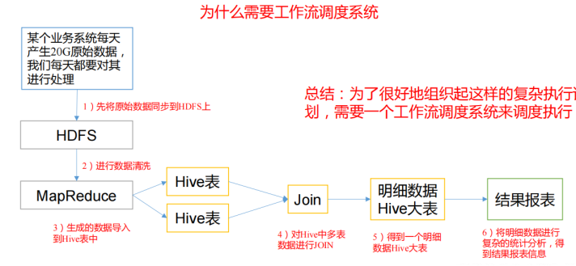
## 1.3 Azkaban 特点
- 兼容任何版本的 hadoop
- 易于使用的 Web 用户界面
- 简单的工作流的上传
- 方便设置任务之间的关系
- 调度工作流
- 模块化和可插拔的插件机制
- 认证/授权(权限的工作)
- 能够杀死并重新启动工作流
- 有关失败和成功的电子邮件提醒
## 1.4 常见的工作调度系统
1. 简单的任务调度：直接使用 crontab 实现；
2. 复杂的任务调度：开发调度平台或使用现成的开源调度系统，比如 ooize、azkaban等
## 1.5 Azkaban 的架构
- Azkaban 由三个关键组件构成：
    - AzkabanWebServer：AzkabanWebServer 是整个 Azkaban 工作流系统的主要管理者，它负责用户登录认证、project管理、定时执行工作流、跟踪工作流执行进度等一系列任务。
    - AzkabanExecutorServer：负责具体的工作流的提交、执行，它们通过mysql数据库来协调任务的执行。
    - 关系型数据库（MySQL）： 存储大部分执行流状态，AzkabanWebServer和AzkabanExecutorServer 都需要访问数据库。

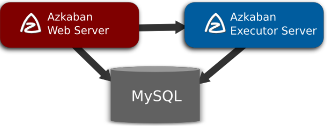
## 1.6 Azkaban 下载地址
下载地址:https://github.com/azkaban/azkaban/tags，从中选择一个版本下载，本文选择3.81.0
# 2. Azkaban安装部署
## 2.1 安装前准备
1. 提前装好java1.8以上以及mysql数据库，最好下载mysql5.x，因为截至目前，azkaban用的mysql驱动仍然是5.x，如果mysql下载的是8.x，启动web和executor时会报验证方式的错误(5.x验证方式default_authentication_plugin=mysql_native_password，8.x验证方式default_authentication_plugin=caching_sha2_password。该问题可以手动更换server/lib和executor/lib下的mysql驱动，但是还会出现另一个时区的问题，该问题需要更改azkaban源码，比较麻烦)
2. yum install git
3. [url](https://www.oracle.com/technetwork/java/javase/downloads/jce8-download-2133166.html)下载,解压后将local_policy.jar和US_export_policy.jar放到JAVA_HOME下/jre/lib/security文件夹里。这一步其实可以不做，如果报错了，再添加这一步
4. 下载Azkaban压缩包，解压并编译
```
mkdir /root/soft
tar -zxvf azkaban-3.81.0.tar.gz -C /root/soft
cd /root/soft
mv azkaban-3.81.0 azkaban_source
cd azkaban_source
```
5. 配置阿里云镜像
```
vim build.gradle
# build.gradle文件中有两处repositories{}需要修改,将maven的url改为阿里云地址，如maven{ url 'http://maven.aliyun.com/nexus/content/groups/public/'}，两处如下
buildscript {
  repositories {
    mavenCentral()
    maven {
      url 'http://maven.aliyun.com/nexus/content/groups/public/'
    }
  }
  dependencies {
    classpath 'com.cinnober.gradle:semver-git:2.2.3'
    classpath 'net.ltgt.gradle:gradle-errorprone-plugin:0.0.14'
    classpath  'com.github.jengelman.gradle.plugins:shadow:4.0.0'
  }
}


allprojects {
  apply plugin: 'jacoco'

  repositories {
    mavenCentral()
    mavenLocal()
    maven{url 'http://maven.aliyun.com/nexus/content/groups/public/'}
  }
}

```
6. 上传gradle包，切换到gradle/wrapper/目录下，查看gradle-wrapper.properties文件最后一行distributionUrl=https\://services.gradle.org/distributions/gradle-4.6-all.zip，说明编译的时候下载该包，提前下载会更好
```
cd /root/soft/azkaban_source/gradle/wrapper
wget https://services.gradle.org/distributions/gradle-4.6-all.zip
vim gradle-wrapper.properties
#  内容如下
distributionBase=GRADLE_USER_HOME
distributionPath=wrapper/dists
zipStoreBase=GRADLE_USER_HOME
zipStorePath=wrapper/dists
distributionUrl=gradle-4.6-all.zip

```
7. 开始编译
```
cd /root/soft/azkaban_source

./gradlew distTar
```
8. 编译好后，取出下图四个文件夹下的tar.gz压缩包，azkaban即使是一台机器也可以部署分布式，单机模式的压缩包仅仅是指出来，这里用不到
- 四个压缩包的具体路径如下：
  - /root/soft/azkaban_source/azkaban-web-server/build/distributions
  - /root/soft/azkaban_source/azkaban-exec-server/build/distributions
  - /root/soft/azkaban_source/azkaban-db/build/distributions
  - /root/soft/azkaban_source/azkaban-solo-server/build/distributions
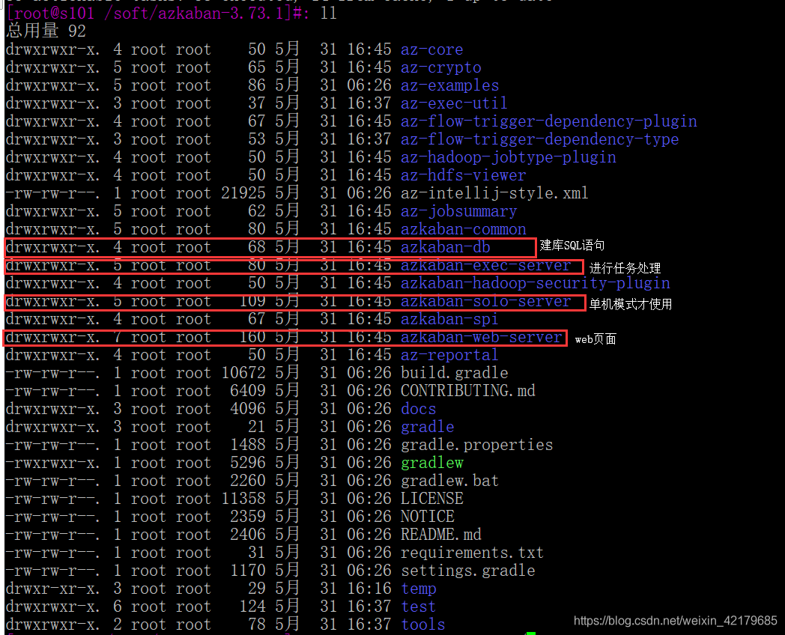
```
mkdir /root/soft/azkaban
mv /root/soft/azkaban_source/azkaban-web-server/build/distributions/azkaban-web-server-0.1.0-SNAPSHOT.tar.gz /root/soft/azkaban
mv /root/soft/azkaban_source/azkaban-exec-server/build/distributions/azkaban-exec-server-0.1.0-SNAPSHOT.tar.gz /root/soft/azkaban
mv /root/soft/azkaban_source/azkaban-db/build/distributions/azkaban-db-0.1.0-SNAPSHOT.tar.gz /root/soft/azkaban
mv /root/soft/azkaban_source/azkaban-solo-server/build/distributions/azkaban-solo-server-0.1.0-SNAPSHOT.tar.gz /root/soft/azkaban
```

## 2.2 安装azkaban
1. 解压azkaban-web-server-2.5.0.tar.gz 、azkaban-executor-server-2.5.0.tar.gz 、azkaban-sqlscript-2.5.0.tar.gz到/root/soft/azkaban目录下
```
tar -zxvf azkaban-exec-server-0.1.0-SNAPSHOT.tar.gz
tar -zxvf azkaban-web-server-0.1.0-SNAPSHOT.tar.gz
tar -zxvf azkaban-db-0.1.0-SNAPSHOT.tar.gz
```
2. 对解压后的文件重新命名
```
mv azkaban-web-server-0.1.0-SNAPSHOT server
mv azkaban-exec-server-0.1.0-SNAPSHOT executor
```
3. azkaban 脚本导入:进入 mysql，创建azkaban 数据库，并将解压的脚本导入到azkaban数据库，如果想为azkaban创建一个专门的mysql用户，也可以，本步省略，直接用root用户。
```
mysql -uroot -p000000 mysql> create database azkaban;
mysql> use azkaban; 
mysql>source /root/soft/azkaban/azkaban-db-0.1.0-SNAPSHOT/create-all-sql-0.1.0-SNAPSHOT.sql;
# source后跟.sql 文件，用于批量处理.sql文件中的sql语句。
exit  # 退出mysql
```
## 2.3 生成密钥对和证书（可学到2.5.1再看）
- keytool是ssl验证(https协议的加密验证)生成证书的一种工具，当使用https时，必须用keytool生成密钥库和密钥对：
  - Keytool 是 java 数据证书的管理工具，使用户能够管理自己的公/私钥对及相关证书。
  - keystore:指定密钥库的名称及位置(产生的各类信息将存在.keystore 文件中)
  - genkey(或者-genkeypair):生成密钥对
  - alias:为生成的密钥对指定别名，如果没有默认是 mykey
  - keyalg :指定密钥的算法 RSA/DSA 默认DSA 
1. 生成 keystore 的密码及相应信息的密钥库
```
[atguigu@hadoop102 azkaban]$ cd /root/soft/azkaban/server  # 要在server下生成，因为是server用
[atguigu@hadoop102 azkaban]keytool -keystore keystore -alias jetty -genkey -keyalg RSA
Enter keystore password:         keystore密钥库密码
Re-enter new password:
What is your first and last name?
  [Unknown]:直接回车即可
What is the name of your organizational unit?
  [Unknown]:
What is the name of your organization?
  [Unknown]:
您所在的城市或区域名称是什么?
  [Unknown]:
您所在的省/市/自治区名称是什么?
  [Unknown]:
该单位的双字母国家/地区代码是什么?
[Unknown]:
Is CN=Unknown, OU=Unknown, O=Unknown, L=Unknown, ST=Unknown, C=Unknown correct?
  [no]: y

Enter key password for <tomacat>
    (RETURN if same as keystore password):与keystore库密码一样直接回车         密钥对密码（jetty密码）
Warning:
The JKS keystore uses a proprietary format. It is recommended to migrate to PKCS12 which is an industry standard format using "keytool -importkeystore -srckeystore /etc/itbiancheng.keystore -destkeystore /etc/itbiancheng.keystore -deststoretype pkcs12".
```
**注意:密钥库的密码至少必须 6 个字符，可以是纯数字或者字母或者数字和字母的组合等等。密钥库的密码最好和<jetty>  的密钥相同，方便记忆。**  
2. 将 keystore 拷贝到azkaban web 服务器根目录中（如果就是在server下创建的，不需要这一步）
```
mv keystore /root/soft/azkaban/server
```
3.查看keystore证书
```
keytool -keystore keystore -list
```
## 2.4 时间同步
1. 如果在/usr/share/zoneinfo/这个目录下不存在时区配置文件Asia/Shanghai，就要用tzselect生成。
```
[atguigu@hadoop102 azkaban]$ tzselect
Please identify a location so that time zone rules can be set correctly. Please select a continent or ocean.
1)Africa
2)Americas
3)Antarctica
4)Arctic Ocean
5)**Asia**
6)Atlantic Ocean
7)Australia
8)Europe
9)Indian Ocean
10)Pacific Ocean
11)none - I want to specify the time zone using the Posix TZ format.
#? 5
Please select a country.
1)Afghanistan	18) Israel	35) Palestine
2)Armenia	19) Japan	36) Philippines
3)Azerbaijan	20) Jordan	37) Qatar
4)Bahrain	21) Kazakhstan	38) Russia
5)Bangladesh	22) Korea (North)	39) Saudi Arabia
6)Bhutan	23) Korea (South)	40) Singapore
7)Brunei	24) Kuwait	41) Sri Lanka
8)Cambodia	25) Kyrgyzstan	42) Syria
9)China	26) Laos	43) Taiwan
10)Cyprus	27) Lebanon	44) Tajikistan
11)East Timor	28) Macau	45) Thailand
12)Georgia	29) Malaysia	46) Turkmenistan
13)Hong Kong	30) Mongolia	47) United Arab Emirates
14)India	31) Myanmar (Burma)	48) Uzbekistan
15)Indonesia	32) Nepal	49) Vietnam
16)Iran	33) Oman	50) Yemen
17)Iraq	34) Pakistan
#? 9
Please select one of the following time zone regions.
1)Beijing Time
2)Xinjiang Time
#? 1

The following information has been given:
            China
            Beijing Time

Therefore TZ='Asia/Shanghai' will be used.
Local time is now:	Thu Oct 18 16:24:23 CST 2018. Universal Time is now: Thu Oct 18 08:24:23 UTC 2018. Is the above information OK?
1)Yes
 2)No
#? 1

You can make this change permanent for yourself by appending the line TZ='Asia/Shanghai'; export TZ
to the file '.profile' in your home directory; then log out and log in again.

Here is that TZ value again, this time on standard output so that you can use the /usr/bin/tzselect command in shell scripts:  Asia/Shanghai
```
2. 拷贝该时区文件，覆盖系统本地时区配置
```
cp /usr/share/zoneinfo/Asia/Shanghai /etc/localtime
```
3. 集群时间同步(同时发给3个窗口)
```
sudo date -s '2018-10-18 16:39:30'   # 强制更改系统时间
```
## 2.5 配置文件
### 2.5.1 web配置
1. 进入 azkaban web 服务器安装目录 conf 目录，打开 azkaban.properties 文件
```
cd /root/soft/azkaban/server/conf
vim azkaban.properties
```
2. 按照如下配置修改 azkaban.properties 文件
```
################################该方式为使用https的方式#########################################################

# Azkaban Personalization Settings
azkaban.name=Test
azkaban.label=My Local Azkaban
azkaban.color=#FF3601
azkaban.default.servlet.path=/index
web.resource.dir=web/
default.timezone.id=Asia/Shanghai           ####################修改时区

# Azkaban UserManager class
user.manager.class=azkaban.user.XmlUserManager
user.manager.xml.file=conf/azkaban-users.xml

# Loader for projects
executor.global.properties=conf/global.properties
azkaban.project.dir=projects

# Velocity dev mode
velocity.dev.mode=false

# Azkaban Jetty server properties.      ########################该部分都需要修改########################################
jetty.use.ssl=true                      ####################将false修改为true，说明使用ssl（https）#######################
jetty.maxThreads=25
jetty.ssl.port=8443  # ssl端口，也即前端端口，一会网址访问时，用该端口
jetty.port=8081
jetty.keystore=/root/soft/azkaban/server/keystore  # keystore地址，一般都在server的根目录下（keystore生成见2.3）
jetty.password=123456
jetty.keypassword=123456
jetty.truststore=/root/soft/azkaban/server/keystore
jetty.trustpassword=123456

# Azkaban Executor settings
executor.port=12321 # executor的端口

# mail settings
mail.sender=
mail.host=

# User facing web server configurations used to construct the user facing server URLs. They are useful when there is a reverse proxy between Azkaban web servers and users.

# enduser -> myazkabanhost:443 -> proxy -> localhost:8081
# when this parameters set then these parameters are used to generate email links.
# if these parameters are not set then jetty.hostname, and jetty.port(if ssl configured jetty.ssl.port) are used.
# azkaban.webserver.external_hostname=myazkabanhost.com
# azkaban.webserver.external_ssl_port=443
# azkaban.webserver.external_port=8081
job.failure.email=
job.success.email=
lockdown.create.projects=false
cache.directory=cache

# JMX stats
jetty.connector.stats=true
executor.connector.stats=true

# Azkaban mysql settings by default. Users should configure their own username and password.   ##############数据库部分根据实际情况修改#####################
database.type=mysql  # 目前只支持mysql
mysql.port=3306
mysql.host=localhost  # mysql的ip
mysql.database=azkaban  # mysql为azkaban创建的数据库名
mysql.user=root  # mysql为azkaban创建的用户名，可以用root，也可以新建
mysql.password=daasan7ujm^YHN
mysql.numconnections=100

#Multiple Executor
azkaban.use.multiple.executors=true
azkaban.executorselector.filters=StaticRemainingFlowSize,MinimumFreeMemory,CpuStatus
azkaban.executorselector.comparator.NumberOfAssignedFlowComparator=1
azkaban.executorselector.comparator.Memory=1
azkaban.executorselector.comparator.LastDispatched=1
azkaban.executorselector.comparator.CpuUsage=1
```
```
################################该方式为使用http的方式(无需使用ssl)#########################################################

# Azkaban Personalization Settings
azkaban.name=Test
azkaban.label=My Local Azkaban
azkaban.color=#FF3601
azkaban.default.servlet.path=/index
web.resource.dir=web/
default.timezone.id=Asia/Shanghai           ####################修改时区

# Azkaban UserManager class
user.manager.class=azkaban.user.XmlUserManager
user.manager.xml.file=conf/azkaban-users.xml

# Loader for projects
executor.global.properties=conf/global.properties
azkaban.project.dir=projects

# Velocity dev mode
velocity.dev.mode=false

# Azkaban Jetty server properties.      ########################该部分不需要修改，和上面ssl对比########################################
jetty.use.ssl=false   # false说明不使用https
jetty.maxThreads=25
jetty.port=8081  # 前端http://ip:端口，中的端口号

# Azkaban Executor settings
executor.port=12321 # executor的端口

# mail settings
mail.sender=
mail.host=

# User facing web server configurations used to construct the user facing server URLs. They are useful when there is a reverse proxy between Azkaban web servers and users.

# enduser -> myazkabanhost:443 -> proxy -> localhost:8081
# when this parameters set then these parameters are used to generate email links.
# if these parameters are not set then jetty.hostname, and jetty.port(if ssl configured jetty.ssl.port) are used.
# azkaban.webserver.external_hostname=myazkabanhost.com
# azkaban.webserver.external_ssl_port=443
# azkaban.webserver.external_port=8081
job.failure.email=
job.success.email=
lockdown.create.projects=false
cache.directory=cache

# JMX stats
jetty.connector.stats=true
executor.connector.stats=true

# Azkaban mysql settings by default. Users should configure their own username and password.   ##############数据库部分根据实际情况修改#####################
database.type=mysql  # 目前只支持mysql
mysql.port=3306
mysql.host=localhost  # mysql的ip
mysql.database=azkaban  # mysql为azkaban创建的数据库名
mysql.user=root  # mysql为azkaban创建的用户名，可以用root，也可以新建
mysql.password=daasan7ujm^YHN
mysql.numconnections=100

#Multiple Executor
azkaban.use.multiple.executors=true
azkaban.executorselector.filters=StaticRemainingFlowSize,MinimumFreeMemory,CpuStatus
azkaban.executorselector.comparator.NumberOfAssignedFlowComparator=1
azkaban.executorselector.comparator.Memory=1
azkaban.executorselector.comparator.LastDispatched=1
azkaban.executorselector.comparator.CpuUsage=1
```
3. web 服务器用户配置:在 azkaban web 服务器安装目录conf目录，按照如下配置修改 azkaban-users.xml 文件， 增加管理员用户。
```
[atguigu@hadoop102 conf]$ vim azkaban-users.xml
<azkaban-users>
<user username="azkaban" password="azkaban" roles="admin" groups="azkaban" />
<user username="metrics" password="metrics" roles="metrics"/>
<user username="admin" password="admin" roles="admin,metrics"/>  # 该行为新加的，配置一个用户名是admin，密码admin，权限为admin(下面指明了两个权限)的user,按照上方格式写就行
<role name="admin" permissions="ADMIN" />
<role name="metrics" permissions="METRICS"/>
</azkaban-users>
```
### 2.5.2 执行服务器配置
1. 进入执行服务器安装目录 conf，打开 azkaban.properties
```
cd /root/soft/azkaban/executor/conf
vim azkaban.properties
```
2. 按照如下配置修改 azkaban.properties 文件
```
################################该方式为使用https的方式#########################################################
# Azkaban Personalization Settings
azkaban.name=Test
azkaban.label=My Local Azkaban
azkaban.color=#FF3601
azkaban.default.servlet.path=/index
web.resource.dir=web/
default.timezone.id=Asia/Shanghai         #######################修改时区########################

# Azkaban UserManager class
user.manager.class=azkaban.user.XmlUserManager
user.manager.xml.file=conf/azkaban-users.xml

# Loader for projects
executor.global.properties=conf/global.properties
azkaban.project.dir=projects

# Velocity dev mode
velocity.dev.mode=false

# Azkaban Jetty server properties.          ##############executor中不需要配置jetty##################
#jetty.use.ssl=false
#jetty.maxThreads=25
#jetty.port=8081

# Where the Azkaban web server is located
azkaban.webserver.url=https://localhost:8443  ###############这里需要修改，说明web的url，这里采用的是https方式，端口为8443##################

# mail settings
mail.sender=
mail.host=

# User facing web server configurations used to construct the user facing server URLs. They are useful when there is a reverse proxy between Azkaban web servers and users.
# enduser -> myazkabanhost:443 -> proxy -> localhost:8081
# when this parameters set then these parameters are used to generate email links.
# if these parameters are not set then jetty.hostname, and jetty.port(if ssl configured jetty.ssl.port) are used.
# azkaban.webserver.external_hostname=myazkabanhost.com
# azkaban.webserver.external_ssl_port=443
# azkaban.webserver.external_port=8081
job.failure.email=
job.success.email=
lockdown.create.projects=false
cache.directory=cache

# JMX stats
jetty.connector.stats=true
executor.connector.stats=true

# Azkaban plugin settings
azkaban.jobtype.plugin.dir=plugins/jobtypes

# Azkaban mysql settings by default. Users should configure their own username and password.     ###########mysql数据库部分根据实际情况修改，参考server###############
database.type=mysql
mysql.port=3306
mysql.host=localhost
mysql.database=azkaban
mysql.user=root
mysql.password=daasan7ujm^YHN
mysql.numconnections=100
# Azkaban Executor settings
executor.maxThreads=50
executor.flow.threads=30
executor.port=12321 # 这里如果要修改，需要和server中的配置文件保持一致
```
```
################################该方式为使用http的方式#########################################################
# Azkaban Personalization Settings
azkaban.name=Test
azkaban.label=My Local Azkaban
azkaban.color=#FF3601
azkaban.default.servlet.path=/index
web.resource.dir=web/
default.timezone.id=Asia/Shanghai         #######################修改时区########################

# Azkaban UserManager class
user.manager.class=azkaban.user.XmlUserManager
user.manager.xml.file=conf/azkaban-users.xml

# Loader for projects
executor.global.properties=conf/global.properties
azkaban.project.dir=projects

# Velocity dev mode
velocity.dev.mode=false

# Azkaban Jetty server properties.          ##############jetty.use.ssl为false，不使用ssl，以下设置一般情况保持默认即可##################
jetty.use.ssl=false # 不使用ssl
jetty.maxThreads=25
jetty.port=8081  # 前端端口8081

# Where the Azkaban web server is located
azkaban.webserver.url=http://localhost:8081  ###############这里需要修改，说明web的url，这里采用的是http方式，端口为8081##################

# mail settings
mail.sender=
mail.host=

# User facing web server configurations used to construct the user facing server URLs. They are useful when there is a reverse proxy between Azkaban web servers and users.
# enduser -> myazkabanhost:443 -> proxy -> localhost:8081
# when this parameters set then these parameters are used to generate email links.
# if these parameters are not set then jetty.hostname, and jetty.port(if ssl configured jetty.ssl.port) are used.
# azkaban.webserver.external_hostname=myazkabanhost.com
# azkaban.webserver.external_ssl_port=443
# azkaban.webserver.external_port=8081
job.failure.email=
job.success.email=
lockdown.create.projects=false
cache.directory=cache

# JMX stats
jetty.connector.stats=true
executor.connector.stats=true

# Azkaban plugin settings
azkaban.jobtype.plugin.dir=plugins/jobtypes

# Azkaban mysql settings by default. Users should configure their own username and password.     ###########mysql数据库部分根据实际情况修改，参考server###############
database.type=mysql
mysql.port=3306
mysql.host=localhost
mysql.database=azkaban
mysql.user=root
mysql.password=daasan7ujm^YHN
mysql.numconnections=100
# Azkaban Executor settings
executor.maxThreads=50
executor.flow.threads=30
executor.port=12321 # 这里如果要修改，需要和server中的配置文件保持一致
``` 
## 2.6 启动Executor服务器
- 在启动executor之前，先修改mysql的一个配置:`vim /etc/my.cnf`，添加`max_allowed_packet=1024M`，重启mysql，如果带jar包执行flow job定时任务，不修改此配置，上传zip包时可能会报错。
- 在 executor 服务器目录下执行启动命令
```
cd /root/soft/azkaban/executor
bin/start-exec.sh   # 一定要在bin目录下启动
```
## 2.7 手动修改mysql，将状态激活
- 这步很重要，不然后面web端会一直起不来，他会报错说execute没有available的，或者执行flow后会一直处于preparing状态，在mysql数据库找到exec-srver，手动激活
```
# 进入mysql 
mysql -u root -p
use azkaban;
select * from executors;      
```
- mysql的executors表存放了executor服务器的信息，上述mysql命令执行后结果如下，可以看到active为0，故没有激活：  
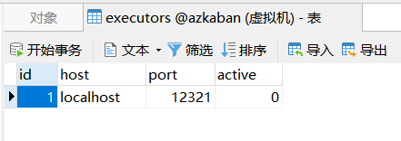 
- 手动激活：`curl -G "localhost:$(<./executor.port)/executor?action=activate" && echo`或者`curl http://${executorhost}:${executorPort}/executor?action=activate`，其中{}需要根据实际情况修改，建议使用第一条命令，只需要根据情况修改localhost（服务器ip）。此处选择第一条命令，执行后，显示{"status":"success"}表示激活成功，active变为1。  
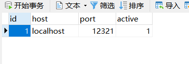 
- **注意executor表中存放的是executor信息，其中的id号后续还会用到，如果是分布式的，会有多个executor服务器，故有多个id号**
## 2.8 启动Web服务器
- 在azkaban web服务器目录下执行启动命令
```
cd /root/soft/azkaban/server
bin/start-web.sh
# 启动的日志在/root/soft/azkaban/server下，可以看到日志文件
```
**注意：先执行executor，再执行web，避免Web Server会因为找不到执行器启动失败。**
- jps 查看进程
```
[atguigu@hadoop102 server]$ jps
16425 AzkabanWebServer
16379 AzkabanExecutorServer
18863 Jps
# 出现以上结果表示启动成功
```
## 2.9 浏览器登录
- 浏览器输入：https://ip:8443或者http://ip:8081打开登录界面
- 在登录中输入刚才在 azkaban-users.xml 文件中新添加的户用名及密码，点击login。

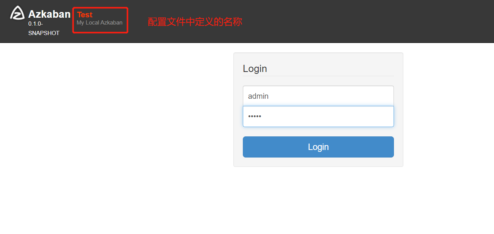  
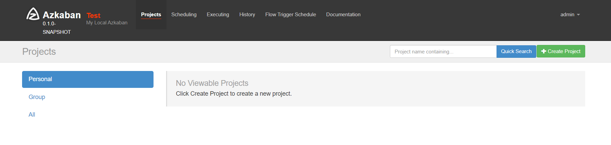

- projects:用于存放工作流所需要的项目文件
- Scheduling：如果有定时任务，在这里配置
- Executing：正在执行的工作流程
- History：已经执行完毕的工作流程  
- Flow Trigger Schedule:
- Documentation:链接到azkaban官方说明文档
**注意：后台如果报证书错误：certificate unknown也能正常使用**
# 3. azkaban实战
- 概念理解：一个工程project包含一个或多个flows，一个flow包含多个job。job是想在azkaban中运行的一个进程。一个job可以依赖于另一个job。这种多个job和他们的依赖组成的图表叫做flow。
- azkaban3.0以后使用Azkaban Flow 2.0 创建Azkaban流程。Flow 1.0 将被弃用，flow 1.0 仅支持command和java两种类型，新版的flow 2.0 支持多种，且构建流程的文件也发生了重大变化。
## 3.1 单一 job 案例
1. 创建 job 描述文件（流程中每一个工作都要写一个job文件）
```
vim first.job  # 必须.job结束
# first.job 
type=command  # 类型
command=echo 'this is my first job'  # job是什么
```
2. 将job资源文件打包成 zip 文件
```
[atguigu@hadoop102 jobs]$ zip first.zip first.job
adding: first.job (deflated 15%)
[atguigu@hadoop102 jobs]$ ll
总用量 8
-rw-rw-r--. 1 atguigu atguigu 60 10 月 18 17:42 first.job
-rw-rw-r--. 1 atguigu atguigu 219 10 月 18 17:43 first.zip
```
- 注意：目前，Azkaban上传的工作流文件只支持xxx.zip 文件。zip应包含 xxx.job 运行作业所需的文件和任何文件（文件名后缀必须以.job 结尾，否则无法识别）。作业名称在项目中必须是唯一的。如果command命令是执行shell脚本，则shell脚本与job文件放到一个文件夹打包。shell脚本的路径尽量用绝对路径（相对路径也可以，以防路径出错，绝对路径更安全）
3. 通过azkaban的web管理平台创建project并上传job的zip包：首先创建 project
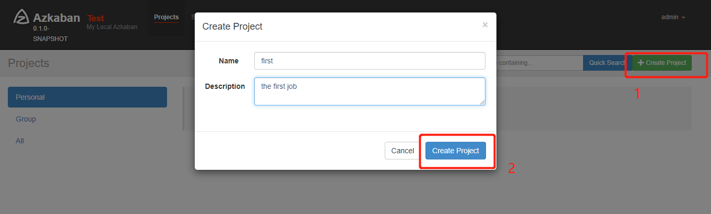    
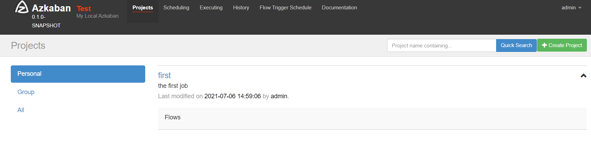
4. 上传zip包(点击first这个project可进入详情页，点击上传)  
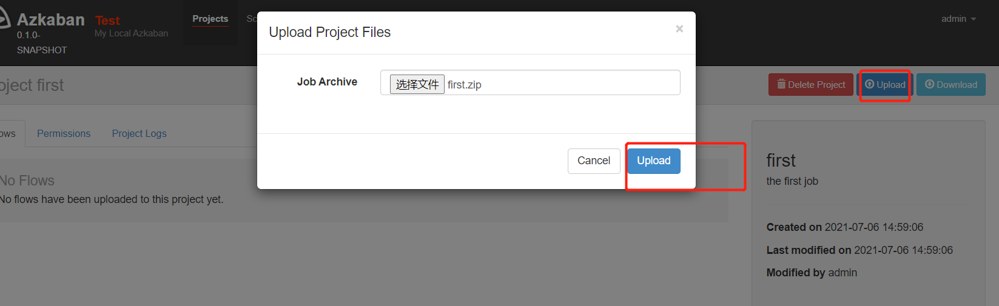    
5. 启动执行该job  
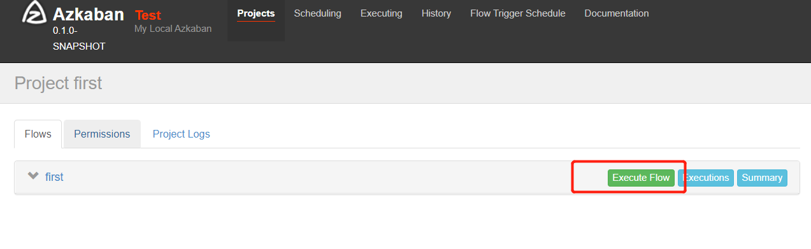  
6. 点击执行工作流  
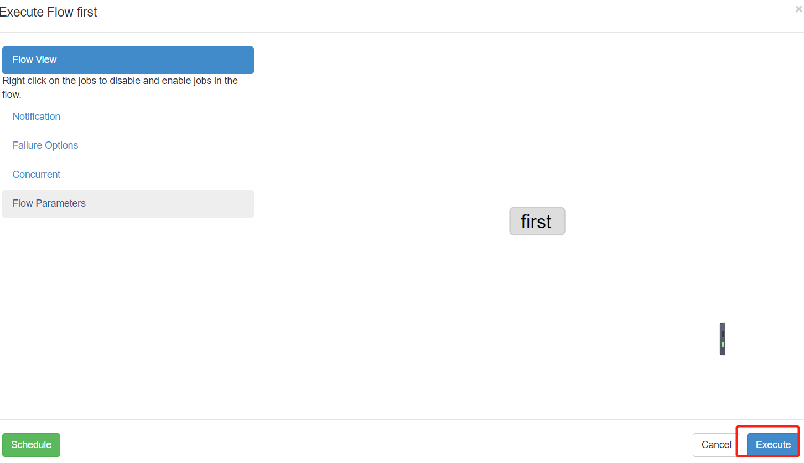  
7. 点击继续  
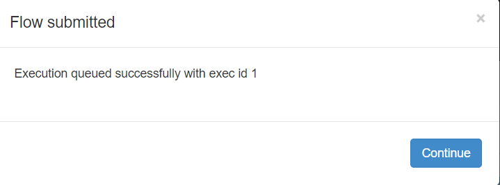  
8. job执行成功  
  
9. 点击查看日志  
  
- 如果上述执行工作流选择schedule后（定时执行），需要配置开始时间、开始频率  
  
  
## 3.2 邮件通知配置案例
1. 修改配置文件：修改 server conf下的azkaban.properties文件（如果需要先停止，可以./server/bin/azkaban-web-shutdown.sh）。以下为发送者的信息，password为第三方授权码，非登录密码
```
mail.sender=lbo_atguigu@163.com
mail.host=smtp.163.com
mail.user=lbo_atguigu@163.com
mail.password=atguiguv587
job.failure.
```
