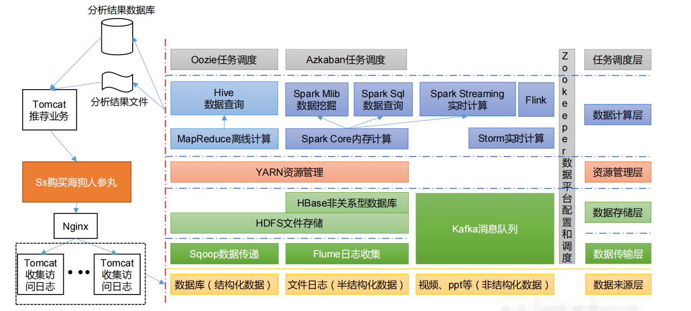

# 1. hadoop是什么
- hadoop是分布式系统基础架构，主要解决**海量数据存储**和**海量数据的分析计算**问题。
- 广义上来说，hadoop通常指一个更广泛的概念：hadoop生态圈，第4章会详细说明。  

# 2. hadoop优势
- 高可靠性：hadoop底层维护多个数据副本，即使hadoop某个计算元素或存储出现故障，也不会导致数据丢失。
- 高扩展性：在集群间分配任务数据，可方便的扩展数以千计的节点（动态增加，动态删除）
- 高效性：在MapReduce思想下，hadoop是并行工作的，以加快任务处理速度
- 高容错性：能够自动将失败的任务重新分配
# 3. hadoop的组成
  
- hadoop1.0时代，MapReduce同时处理业务逻辑运算和资源的调度（计算时分配多少内存，在哪个服务器上运行等等），耦合性较大。
- 2.0时代增加了Yarn。Yarn只负责资源的调度，MapReduce只负责运算
- 3.0在组成上没有变化，主要包括HDFS、YARN、MapReduce
## 3.1 HDFS架构概述：任务存储
- HDFS：Haddoop Distributed File System，简称HDFS，是一个分布式文件系统，主要用于解决数据的存储问题
- HDPS由三个单元组成：
    - NameNode(nn)：存储文件的元数据。比如文件目录结构，文件名，文件属性（生成时间、副本数、文件权限），以及每个文件的块列表和块所在的DataNode等。
    - DataNode(dn)：简单来讲就是存放真实的数据。官方语言：在本地文件系统存储文件块数据，以及块数据和校验和。DataNode的数据都有进行备份。
    - Secondary Node(2nn)：每隔一段时间，对NameNode的元数据进行备份，防止NameNode宕机后，不知道各个数据存储在哪里
## 3.2 YARN架构概述：资源调度
- YARN：Yet Another Resource Negotiator，是hadoop的资源管理器
- YARN由以下单元构成：
    - ResourceManger(RM):负责管理整个集群的资源(内存、cpu等)，如下图，由于每个NodeManger都是4G内存，2GPU，ResourceManger就负责管理12G内存，6GPU。
    - NodeManger(NM):负责管理单个节点服务器的资源，如下图所示。
    - Container:容器，位于单个服务器节点之上，相当于在服务器上虚拟出一个小型的虚拟机，里面封装了任务运行所需要的资源，如内存、cpu、磁盘、网络等。
    - ApplicationMaster(AM):负责管理单个任务的运行，位于Container里面，即任务运行在Container这个小型虚拟机里
- YARN运行原理：当客户端进行作业提交后(Job Submission),ResourceManger就会进行资源的分配，安排其在某个NodeManger的某个Container中进行运行，一个任务可以运行在多个Container上，多个Container可以分布在不同的NodeManger单点服务器上。
- 注：客户端可以有多个；集群上可以运行多个ApplicationMaster；每个NodeManger上可以有多个Container。  

## 3.3 MapReduce架构概述：任务计算
- MapReduce：主要负责任务的计算，其计算过程分为两个阶段：
    - Map阶段：并行处理输入数据，如想要在服务器集群中查找hadoop的整套教学视频，首先会进行任务的派发，让每个服务器去寻找。
    - Reduce阶段：对Map结果进行汇总。有一台汇总服务器会将Map中各个节点的结果进行汇总，这样就找到了结果。  

## 3.4 HDFS、YARN、MapReduce三者的关系

# 4. 大数据技术生态体系

- Sqoop 是一款开源的工具，主要用于在 Hadoop、Hive 与传统的数据库（MySQL）间进行数据的传递，可以将一个关系型数据库（例如：MySQL，Oracle 等）中的数据导进到 Hadoop 的 HDFS 中，也可以将 HDFS 的数据导进到关系型数据库中。
- flume：Flume 是一个高可用的，高可靠的，分布式的海量日志采集、聚合和传输的系统，Flume 支持在日志系统中定制各类数据发送方，用于收集数据。
- kafka：Kafka 是一种高吞吐量的分布式发布订阅消息系统
- spark：Spark 是当前最流行的开源大数据内存计算框架。可以基于 Hadoop 上存储的大数据进行计算。
- Flink：Flink 是当前最流行的开源大数据内存计算框架。用于实时计算的场景较多
- Oozie：Oozie 是一个管理 Hadoop 作业（job）的工作流程调度管理系统。
- Hbase：HBase 是一个分布式的、面向列的开源数据库。HBase 不同于一般的关系数据库，它是一个适合于非结构化数据存储的数据库。
- Hive：Hive 是基于 Hadoop 的一个数据仓库工具，可以将结构化的数据文件映射为一张数据库表，并提供简单的SQL查询功能，可以将SQL语句转换为 MapReduce任务进行运行。其优点是学习成本低，可以通过类SQL语句快速实现简单的 MapReduce统计，不必开发专门的 MapReduce应用，十分适合数据仓库的统计分析。
- ZoopKeeper：它是一个针对大型分布式系统的可靠协调系统，提供的功能包括：配置维护、名字服务、分布式同步、组服务等。
- 推荐项目框架图如下：

# 5. hadoop安装
## 5.1 hadoop的三种安装/运行模式
hadoop官方提供了三种安装/运行模式：
    - 本地模式：单机运行，只是用来演示一下官方案例。生产环境不用
    - 伪分布式模式：也是单机运行，但是具备hadoop集群的所有功能，一台服务器模拟一个分布式的环境。生产环境不用
    - 完全分布式模式：多台服务器组成分布式环境。生产环境使用。
- 本次侧重讲述完全分布式模式。
## 5.2 安装前准备
- hadoop完全分布式模式需要多台虚拟机，可以先安装一台虚拟机，然后克隆虚拟机：
    - 安装第一台虚拟机的方式可用vmware，这里不再赘述
    - 如果第一台虚拟机安装的是最小系统版，需要进行以下操作：
        - 修改主机名为hadoop100：`hostnamectl set-hostname hadoop100`，重启：`reboot`
        - 安装epel-release，是“红帽系”的操作系统提供额外的软件包，适用于 RHEL、Centos、Seientific Linux。相当于一个软件仓库，大多数rpm包在官方repository中是找不到的：`yum install epel-release`
        - 安装net-tools：`yum install net-tools`
        - 安装vim：`yum install vim`
        - 安装rsync：按照以下方式安装，rsync命令的参数及配置文件参数含义见博客：https://www.cnblogs.com/koushuige/p/9162920.html
        ```
        yum -y install rsync  
        #启动rsync服务
        systemctl start rsyncd.service  # 启动
        systemctl enable rsyncd.service  # 设置开机自启

        #检查是否已经成功启动
        netstat -lnp|grep 873  
        ```
        - 关闭防火墙：`systemctl stop firewalld`；取消开机自启：`systemctl disable firewalld.service`
        - 添加用户，修改密码，及用户组权限：
            - 添加名为user的用户：`useradd user`
            - 修改user的密码：passwd user
            - 配置user用户具有root权限:`vim /etc/sudoers`，在%wheel ALL=(ALL) ALL下面插入一行`user ALL=(ALL) ALL`，如果想设置切换到user后，免密，可以写成`user ALL=(ALL) NOPASSWD: ALL`。此外还需要注意，该行必须插入到whell下面，表示选择将用户设置为允许任何操作或者是将用户添加到一个允许任何命令操作的用户组中。如果添加到root ALL=(ALL) ALL下面，表示名为root的用户允许任何命令操作，这样是不可以的。(切换用户，使用`su user`，切换root，直接`su`，现在还不需要切换)
            - 创建module、software文件夹：`mkdir /opt/module`, `mkdir /opt/software`
            - 修改module、software文件夹的所有者和所属组均为user用户：`chown user:user /opt/module`，`chown user:user /opt/software`
        - 卸载虚拟机自带的jdk：`rpm -qa | grep -i java | xargs -n1 rpm -e --nodeps`:
            - rpm -qa:查询所安装的所有rpm软件包
            - grep -i: 忽略大小写
            - xargs -n1:表示每次只传递一个参数
            - rpm -e --nodeps:强制卸载软件
        - 重启虚拟机：`reboot`
    - 克隆虚拟机：利用模板机hadoop100，克隆三台虚拟机hadoop102/hadoop103/hadop104:
        - 克隆前先关闭hadoop100
        - 利用vmware克隆虚拟机：
            - hadoop100上右键-管理-克隆
            - 根据安装向导安装，其中克隆类型，要选择创建完整克隆，虚拟机名称hadoop102，位置自定义，完成即可。同样的方法克隆hadoop103、hadoop104。
    - 修改克隆虚拟机的相关配置（以hadoop102为例）：
        - 启动hadoop102
        - 修改hadoop102的主机名：`hostnamectl set-hostname hadoop102`
        - 修改hosts文件：`sudo vim /etc/hosts`(如果是以user登录的，必须加sudo)。添加以下内容：
            ```
            192.168.109.140    hadoop100
            192.168.109.142    hadoop102
            192.168.109.143    hadoop103
            192.168.109.144    hadoop104
            ```
        - 重启hadoop102：`reboot`
    - 在hadoop102上安装jdk，不需要在hadoop3、hadoop4重复安装，只需要拷贝即可：
        - 将安装包放到/opt/software下
        - 解压安装包到/opt/module下：`tar -zxvf /opt/software/jdk-8u281-linux-x64.tar.gz -C /opt/module/`
        - 配置环境变量：
            - 新建/etc/profile.d/my_env.sh文件：`sudo touch /etc/profile.d/my_env.sh`
            - 添加以下内容`sudo vim /etc/profile.d/my_env.sh`：
            ```
            #JAVA_HOME
            export JAVA_HOME=/opt/module/jdk1.8.0_281
            export PATH=$PATH:$JAVA_HOME/bin
            ```
            - 重启profile：`source /etc/profile`
            - 测试：`java -version`

## 5.3 安装hadoop
- 只需要在hadoop2上安装hadoop即可，其他服务器直接拷贝，类似java安装
- hadoop版本下载地址：https://archive.apache.org/dist/hadoop/common/hadoop-3.1.3/，下载hadoop-3.1.3.tar.gz
- 将tar.gz安装包放到/opt/software下
- 解压到/opt/module下：`tar -zxvf /opt/software/hadoop-3.1.3.tar.gz -C /opt/module/`
- 将hadoop添加到环境变量
    - 编辑：`sudo vim /etc/profile.d/my_env.sh`，添加以下内容：
    ```
    #HADOOP_HOME
    export HADOOP_HOME=/opt/module/hadoop-3.1.3
    export PATH=$PATH:$HADOOP_HOME/bin
    export PATH=$PATH:$HADOOP_HOME/sbin
    ```
    - 重启profile文件：`source /etc/profile`
- 测试是否安装成功：hadoop version
## 5.4 hadoop安装目录

- bin：存放对hadoop相关服务（hdfs、yarn、MapReduce）进行操作的脚本
- etc：hadoop的配置文件目录，存放hadoop的配置文件
- lib：存放hadoop的本地库（对数据进行压缩解压缩功能）
- sbin：存放启动或停止hadoop相关服务的脚本
- share：存放hadoop的依赖jar包、文档、官方案例。
# 6. hadoop运行模式
&emsp;&emsp;在第五章提到，hadoop的安装/运行模式分为三种，本章讲述单机模式和完全分布式模式，重点是完全分布式模式，单机模式了解即可
## 6.1 单机模式
- 在hadoop-3.1.3目录下创建一个wcinput文件夹：`mkdir /opt/module/hadoop-3.1.3/wcinput`
- 在wcinput文件夹下新建一个word.txt文件：`touch /opt/module/hadoop-3.1.3/wcinput/word.txt`
- 编辑word.txt文件：`vim word.txt`,在文本中输入以下内容：
```
hadoop yarn
hadoop mapreduce
user
user
```
- 切换到hadoop-3.1.3目录：`cd /opt/module/hadoop-3.1.3`
- 执行程序：`hadoop jar share/hadoop/mapreduce/hadoop-mapreduce-example-3.1.3.jar wordcount wcinput wcoutput`
- 查看结果：`cat wcoutput/part-r-00000`，结果如下：
```
user 2
hadoop 2
mapreduce
yarn 1
```
## 6.2 完全分布式模式
- 前提：按照之前章节准备好了虚拟机，环境等
- 将hadoop2中的java和hadoop拷贝到hadoop3和hadoop4上：
    - 方法一scp：
    ```
    # -r为递归的意思
    scp -r /opt/module/hadoop-3.1.3/ user@hadoop103:/opt/module/
    scp -r /opt/module/hadoop-3.1.3/ user@hadoop104:/opt/module/
    scp -r /opt/module/jdk1.8.0_281/ user@hadoop103:/opt/module/
    scp -r /opt/module/jdk1.8.0_281/ user@hadoop104:/opt/module/
    ```
    - 方法二rsync：
    ```
    # rsync主要用于备份和镜像，具有速度快、避免复制相同内容和支持符号链接的有点
    # rsync与scp区别：rsync做文件的复制比scp快，rsync只对差异文件做更新，scp是复制所有文件
    # 第一次使用rsync的效果等同于scp
    # 参数-a：归档拷贝；参数-v：显示复制过程
    
    # 使用rsync进行拷贝
    rsync -av /opt/module/hadoop-3.1.3/ user@hadoop103:/opt/module/hadoop-3.1.3/
    rsync -av /opt/module/hadoop-3.1.3/ user@hadoop104:/opt/module/hadoop-3.1.3/
    rsync -av /opt/module/jdk1.8.0_281/ user@hadoop103:/opt/module/jdk1.8.0_281/
    rsync -av /opt/module/jdk1.8.0_281/ user@hadoop104:/opt/module/jdk1.8.0_281/
    ```
    - 方法三**推荐**xsync集群分发脚本：方法一和方法二都有一个缺点：如果有100台服务器，需要复制100次，这样很麻烦，因此，带来一个新的需求：循环复制文件到所有节点的相同目录下。因此，可以编写一个xsync的脚本：
        - 为了能让脚本在任何路径下使用，需要将脚本放到PATH的路径下，`echo $PATH`查看都有哪些环境变量
        - 选择/home/user/bin这个目录存放xsync脚本：`mkdir /home/user/bin`， `touch /home/user/bin/xsync`
        - 编辑xsync脚本：`vim xsync`，内容如下：
        ```
        #!/bin/bash

        # 1. judge number of parameters, S#:get numbers of parameters, lt 1: less 1
        if [ $# -lt 1 ]
        then
            echo Not Enough Arguement!
            exit;
        fi

        # 2. traverse all servers,***********************************注意：for循环这里，需要根据情况改成相应的主机名*******************************************************
        for host in hadoop102 hadoop103 hadoop104
        do
            echo =======current host: $host=================
            # 3. travelse all directory and send
            # $@: get all parameters
            echo **********all paratemerts:$@******************
            for file in $@
            do
                # 4. judge whether the file exists
                if [ -e $file ]
                    then
                        # 5. get father directory
                        pdir=$(cd -P $(dirname $file); pwd)
                        echo ------father directory: $pdir------
                        # 6. get current file name
                        fname=$(basename $file)
                        echo ----------------current file:$fname-----------
                        ssh $host "mkdir -p $pdir"  # make father directory on host, but we are still on current host
                        rsync -av $pdir/$fname $host:$pdir  # rsync
                    else
                        echo $file does not exists!
                fi
            done
        done
        ```
        - 修改脚本具有可执行权限:`chmod +x xsync`
        - 测试脚本运行：`xsync /home/user/bin`。意思就是将当前主机下的/home/user/bin文件夹传送到hadoop102、hadoop103、hadoop104这三台机器。（传送前会在hadoop102、hadoop103、hadoop104三台机器上创建父文件夹，代码已实现该功能），该步虽然写的是测试，但在实际中也是需要的，作用就是将xsync脚本同步到其他服务器
        - 将脚本复制到/bin 中，以便全局调用:`sudo cp xsync /bin/`，因为分发root相关权限的文件时需要加sudo，加了sudo认为是root，xsync目前只是user的环境变量，非root的环境变量
        - 将/bin下的xsync同步到其他几台服务器：`sudo xsync /bin/xsync`
        - 将/opt/module同步到其他几台服务器：`sudo xsync /opt/module`
        - 同步module下的java和hadoop后，其他几台服务器的环境变量文件还没有配置，因此同步环境变量文件：`sudo xsync /etc/profile.d/my_env.sh`
        - 环境变量生效：切换到其他几台服务器分别进行`source /etc/profile`
        - 此后，如有任何修改，都需要通过xsync同步到其他几台服务器
- 设置ssh免密：xsync脚本中有一行代码ssh，一般ssh到别的服务器都需要密码，为了省略输入密码这一步，可以通过配置密钥对的方式免密。
    - 密钥对原理如下所示：
        - 假如服务器A想ssh到服务器B，那么一般情况下，需要输入B的密码。
        - 切换到/home/user/目录，在A服务器上执行`ssh-keygen -t rsa`可以生成密钥对，公钥(id_rsa.pub)和私钥(id_ras)，公钥是给别人用的，私钥是自己的千万不要给别人
        - 将A生成的公钥拷贝到B上
        - 在A上sshB，此时数据用私钥A加密
        - B接收到数据后，去授权Key中查找A的公钥，并解密数据
        - B解密出来后，采用A公钥加密的数据返回给A
        - A接收到数据后，用A的私钥解密数据
        - 以上就完成了ssh的免密登录
        
    - 本次实战的过程如下(操作均在hadoop2上执行)：
        - `cd /home/user/`
        - `ssh-keygen -t rsa`，执行后，询问语句执行按回车即可
        - `cd .ssh`, `ls`，可以查看到生成的公钥和私钥文件
        - 将公钥拷贝到需要ssh的服务器上：`ssh-copy-id hadoop102`, `ssh-copy-id hadoop103`, `ssh-copy-id hadoop104`
        - 此外还需要在hadoop103上采用user账号配置无密登录到hadoop102、hadoop103、hadoop104；还需要在hadoop104上采用user账号配置无密登录到hadoop102、hadoop103、hadoop104；还需要在hadoop102上采用root账号配置无密登录到hadoop102、hadoop103、hadoop104。
    - .ssh文件下文件介绍：
        - known_hosts: 记录ssh访问过计算机的公钥（public key）
        - id_rsa: 生成的私钥
        - id_rsa.pub: 生成的公钥
        - authorized_keys: 存放授权过的无密登录服务器公钥
# 7. hadoop集群配置
- 第六章只是讲述了如何将安装在hadoop102上的java、hadoop等分发到其他服务器，但是，到目前为止，hadoop102、hadoop103、hadoop104三台服务器还没有任何联系，因此需要进行集群配置。
- 集群规划如下：
    - NameNode和SecondaryNameNode都很耗费内存，因此最好不要安装在同一台服务器
    - ResourceManger也很消耗内存，最好不要和NameNode、SecondNameNode配置在同一台服务器。
    - 最终的服务器规划如下所示(该规划非常非常重要，后续进行文件配置都依赖于该规划)：
    
- 配置文件说明：
    - hadoop配置文件分为两大类：默认配置文件和自定义配置文件，只有用户想修改某一默认配置值时，才需要修改自定义配置文件，更改相应的属性值
        - 默认配置文件：
            - core-default.xml：核心配置文件，路径：/opt/module/hadoop-3.1.3/share/doc/hadoop/hadoop-project-dist/hadoop-common/core-default.xml
            - hdfs-default.xml：hdfs配置文件，路径：/opt/module/hadoop-3.1.3/share/doc/hadoop/hadoop-project-dist/hadoop-hdfs/hdfs-default.xml
            - yarn-default.xml：yarn配置文件，路径：/opt/module/hadoop-3.1.3/share/doc/hadoop/hadoop-project-dist/hadoop-hdfs/hdfs-default.xml
            - mapred-default.xml：MapReduce配置文件，路径：/opt/module/hadoop-3.1.3/share/doc/hadoop/hadoop-mapreduce-client/hadoop-mapreduce-client-core/mapred-default.xml
        - 自定义配置文件（下述配置文件路径均为：/opt/module/hadoop-3.1.3/etc/hadoop/）：
            - core-sit.xml：核心配置文件
            - hdfs-site.xml：hdfs配置文件
            - yarn-site.xml：yarn配置文件
            - mapred-site.xml：MapReduce配置文件
- 配置4大自定义文件：
    - 配置核心文件：  
    
    ```
    <?xml version="1.0" encoding="UTF-8"?>
    <?xml-stylesheet type="text/xsl" href="configuration.xsl"?>
    <!--
    Licensed under the Apache License, Version 2.0 (the "License");
    you may not use this file except in compliance with the License.
    You may obtain a copy of the License at

        http://www.apache.org/licenses/LICENSE-2.0

    Unless required by applicable law or agreed to in writing, software
    distributed under the License is distributed on an "AS IS" BASIS,
    WITHOUT WARRANTIES OR CONDITIONS OF ANY KIND, either express or implied.
    See the License for the specific language governing permissions and
    limitations under the License. See accompanying LICENSE file.
    -->

    <!-- Put site-specific property overrides in this file. -->

    <configuration>
        <!-- 指定NameNode的地址，按照规划是hadoop102这台服务器，hadoop内部通信端口设为8020，name就是默认配置文件该功能的名称 -->
        <property>
            <name>fs.defaultFS</name>
            <value>hdfs://hadoop102:8020</value>
        </property>

        <!-- 指定hadoop数据的存储目录 -->
        <property>
            <name>hadoop.tmp.dir</name>
            <value>/opt/module/hadoop-3.1.3/data</value>
        </property>

        <!-- 配置HDFS网页登录使用的静态用户名为admin -->
        <property>
            <name>hadoop.http.staticuser.user</name>
            <value>admin</value>
        </property>
    </configuration>

    ```
    - 配置HDFS文件：
    
    ```
    <?xml version="1.0" encoding="UTF-8"?>
    <?xml-stylesheet type="text/xsl" href="configuration.xsl"?>
    <!--
    Licensed under the Apache License, Version 2.0 (the "License");
    you may not use this file except in compliance with the License.
    You may obtain a copy of the License at

        http://www.apache.org/licenses/LICENSE-2.0

    Unless required by applicable law or agreed to in writing, software
    distributed under the License is distributed on an "AS IS" BASIS,
    WITHOUT WARRANTIES OR CONDITIONS OF ANY KIND, either express or implied.
    See the License for the specific language governing permissions and
    limitations under the License. See accompanying LICENSE file.
    -->

    <!-- Put site-specific property overrides in this file. -->

    <configuration>
        <!-- 设置web端访问的NameNode服务器和端口 -->
        <property>
            <name>dfs.namenode.http-address</name>
            <value>hadoop102:9870</value>
        </property>

        <!-- 设置web端访问的SecondNameNode服务器和端口 -->
        <property>
            <name>dfs.namenode.secondary.http-address</name>
            <value>hadoop104:9868</value>
        </property>

    </configuration>
    ```
    - 配置YARN文件  
    
    ```
    <?xml version="1.0"?>
    <!--
    Licensed under the Apache License, Version 2.0 (the "License");
    you may not use this file except in compliance with the License.
    You may obtain a copy of the License at

        http://www.apache.org/licenses/LICENSE-2.0

    Unless required by applicable law or agreed to in writing, software
    distributed under the License is distributed on an "AS IS" BASIS,
    WITHOUT WARRANTIES OR CONDITIONS OF ANY KIND, either express or implied.
    See the License for the specific language governing permissions and
    limitations under the License. See accompanying LICENSE file.
    -->
    <configuration>
        <!-- 指定MapReduce走shuffle，具体不用太了解 -->
        <property>
            <name>yarn.resourcemanager.aux-services</name>
            <value>mapreduce_shuffle</value>
        </property>

        <!-- 指定ResourceManagerd的地址 -->
        <property>
            <name>yarn.resourcemanager.hostname</name>
            <value>hadoop103</value>
        </property>

        <!-- 环境变量的继承 -->
        <property>
            <name>yarn.nodemanager.env-whitelist</name>
            <value>JAVA_HOME,HADOOP_COMMON_HOME,HADOOP_HDFS_HOME,HADOOP_CONF_DIR,CLASSPATH_PREPEND_DISTCACHE,HADOOP_YARN_HOME,HADOOP_MAPRED_HOME</value>
        </property>
    </configuration>
    ```
    - 配置MapReduce文件  
    
    ```
    <?xml version="1.0"?>
    <?xml-stylesheet type="text/xsl" href="configuration.xsl"?>
    <!--
    Licensed under the Apache License, Version 2.0 (the "License");
    you may not use this file except in compliance with the License.
    You may obtain a copy of the License at

        http://www.apache.org/licenses/LICENSE-2.0

    Unless required by applicable law or agreed to in writing, software
    distributed under the License is distributed on an "AS IS" BASIS,
    WITHOUT WARRANTIES OR CONDITIONS OF ANY KIND, either express or implied.
    See the License for the specific language governing permissions and
    limitations under the License. See accompanying LICENSE file.
    -->

    <!-- Put site-specific property overrides in this file. -->

    <configuration>
        <!-- 指定MapReduce程序运行在Yarn上，默认是local -->
        <property>
            <name>mapreduce.framework.name</name>
            <value>yarn</value>
        </property>
    </configuration>
    ```
- 在集群上分发配置好的Hadoop配置文件：`xsync /opt/module/hadoop-3.1.3/etc/hadoop/`，分发好以后可以自己去别的服务器看一看有没有分发成功。
# 8. 群起服务器
- 配置workers:
    - `vim /opt/module/hadoop-3.1.3/etc/hadoop/workers`，改为以下内容，有几台服务器就写几台，注意该文件中添加的内容结尾不允许有空格，文件中不允许有空行
    ```
    hadoop102
    hadoop103
    hadoop104
    ```
    - 同步所有节点配置文件：`xsync /opt/module/hadoop-3.1.3/etc`
- 启动集群：
    - 如果集群是第一次启动，需要在hadoop102节点格式化NameNode（注意：格式化NameNode，会产生新的集群id，导致NameNode和DataNode的集群id不一致，集群找不到以往的数据。如果集群在运行过程中报错，需要重新格式化NameNode的话，一定要先停止namenode和datanode进程，并且要删除所有机器的data和logs目录，然后再进行格式化）：`hdfs namenode -format`
    - 启动HDFS：`cd /opt/module/hadoop-3.1.3`，`sbin/start-dfs.sh`
    - 在**配置了ResourceManager的节点**(hadoop103)启动YARN：`cd /opt/module/hadoop-3.1.3`，`sbin/start-yarn.sh`
    - web端查看HDFS的NameNode：
        - 浏览器输入：[http://hadoop102:9870](http://hadoop102:9870)，查看hdfs数据存储信息。如何无法显示，将hadoop2改为该台机器的ip
        - 浏览器界面用得最多的是utilities-Browse the file system，这里面展示了有哪些文件。还有log，可以看到log信息  
        
        - 浏览器输入：[http://hadoop103:8088](http://hadoop103:8088)，查看yarn上运行的job信息。如何无法显示，将hadoop3改为该台机器的ip
        - 运行任务时就可以在页面看到变化  
           
- 路径：/opt/module/hadoop-3.1.3/data/dfs/name/current有一个VERSION文件，里面存储了hadoop的版本信息

- 集群测试：
    - 上传文件：
        - 在hadoop的hdfs上创建一个input文件夹：`hadoop fs -mkdir /input`。一般hdfs命令都要带上hadoop和fs，其中fs表示hdfs，后面的-makedir就是linux命令
        - 查看hadoop的hdfs是否有/input文件夹：`hadoop fs -ls /`，结果为：`drwxr-xr-x   - user supergroup          0 2021-07-18 20:48 /input`
        - 上传服务器文件到hdfs上：`hadoop fs -put /home/user/test.txt /input`，put是上传本地文件到hdfs上。test.txt文件是已经存放在服务器上的。
        - 查看hdfs是否收到文件：`hadoop fs -ls /input`，结果为`-rw-r--r--   3 user supergroup         72 2021-07-18 20:48 /input/test.txt`
        - 查看web页面：
          
          
        
        - 下载过程中如果出现如下问题，打开windows的hosts文件，添加如下内容  
        
        ```
        192.168.109.142 hadoop102
        192.168.109.143 hadoop103
        192.168.109.144 hadoop104  
        ```
    - hadoop文件路径：/opt/module/hadoop-3.1.3/data/dfs/data/current/BP-961449125-192.168.109.142-1626485486041/current/finalized/subdir0/subdir0。/input是hdfs存放数据的路径，web前端可以看到，那么hadoop存在文件路径位于前述目录，可以使用cat命令查看文件内容。  
    
    -测试yarn-执行hadoop自带的wordcount：
        - 输入命令：`hadoop jar /opt/module/hadoop-3.1.3/share/hadoop/mapreduce/hadoop-mapreduce-examples-3.1.3.jar wordcount /input/ /output`。hadoop-mapreduce-examples-3.1.3.jar是haddop自带的一个具有统计功能的jar包，输入是/input下的文件，输出到output。
        - web端查看结果：  
        
# 9. 配置历史服务器
- 为了查看程序的历史运行情况，需要配置一下历史服务器。具体配置如下：
    - 配置mapred-sit.xml
    ```
    <configuration>
        <!-- 指定MapReduce程序运行在Yarn上，默认是local -->
        <property>
            <name>mapreduce.framework.name</name>
            <value>yarn</value>
        </property>

        <!-- 历史服务器地址 -->
        <property>
            <name>mapreduce.jobhistory.address</name>
            <value>hadoop102:10020</value>
        </property>

        <!-- 历史服务器web端地址 -->
        <property>
            <name>mapreduce.jobhistory.webapp.address</name>
            <value>hadoop102:19888</value>
        </property>

    </configuration>
    ```
    - 分发配置：xsync /opt/module/hadoop-3.1.3/etc/hadoop
    - 在hadoop102上启动历史服务器：`mapred --daemon start historyserver`
    - 查看历史服务器是否启动成功：jps或者前端：http://hadoop102:19888/jobhistory
# 10. 配置日志的聚集
- 什么是日志的聚集：应用运行完成以后，将程序运行日志信息上传到HDFS系统上。好处：可以方便的查看程序运行详情，方便开发调试。**注意：开启日志聚集功能，需要重新启动NodeManager、ResourceManager、historyserver**。
    - 配置yarm-site.xml
    ```
    <!-- 开启日志聚集功能 -->
    <property>
        <name>yarn.log-aggregation-enable</name>
        <value>true</value>
    </property>

    <!-- 设置日志聚集服务器地址 -->
    <property>
        <name>yarn.log.server.url</name>
        <value>http://hadoop102:19888/jobhistory/logs</value>
    </property>

    <!-- 设置日志保留时间为7天 -->
    <property>
        <name>yarn.log-aggregation.retain-seconds</name>
        <value>604800</value>

    ```
    - 分发配置：`xsync /opt/module/hadoop-3.1.3/etc/hadoop`
    - 关闭NodeManger、ResourceManger和HistoryServer
    ```
    # 在hadoop103服务器上
    cd /opt/module/hadoop-3.1.3/
    sbin/stop-yarn.sh
    # 在hadoop102服务器上
    mapred --daemon stop historyserver
    ```
    - 启动NodeManger、ResourceManger和HistoryServer
    ```
    # 在hadoop103上
    sbin/start-yarn.sh
    # 在hadoop102上
    mapred --daemon start historyserver
    ```
    - 删除HDFS已经存在的传输文件：`hadoop fs -rm -r /output`
    - 执行wordcount程序：`hadoop jar /opt/module/hadoop-3.1.3/share/hadoop/mapreduce/hadoop-mapreduce-examples-3.1.3.jar wordcount /input/ /output`
    - 查看日志：历史服务器：[http://hadoop102:19888/jobhistory](http://hadoop102:19888/jobhistory)
      
      
      
# 11. 集群启动或停止的方法总结
- 停止或启动hdfs：
    - 整体启动或停止：`sbin/start-dfs.sh`， `sbin/stop-dfs.sh`
    - 各个服务器组件逐个启动或停止：`hdfs --daemon start/stop namenode/datanode/secondarynamenode`，停止还可以使用jps后，搭配kill -9 id号。
- 停止或启动yarn：
    - 整体启动或停止：`sbin/start-yarn.sh`， `sbin/stop-yarn.sh`
    - 各个服务器组件逐个启动或停止：`yarn --daemon start/stop resourcemanager/nodemanager`，停止还可以使用jps后，搭配kill -9 id号。
- 启动或停止历史服务器：
    - 启动或停止：`mapred --daemon start/stop historyserver`，停止还可以使用jps后，搭配kill -9 id号。
- 编写脚本启停服务：参考上文xsync脚本的编写
# 12. 常用端口说明

# 13. 集群时间同步
- 如果服务器在公网（能连通外网），可以不采用集群时间同步，因为服务器会定期和公网时间进行校准；如果服务器在内网环境，必须要配置集群时间同步，否则时间久了，会产生时间偏差，导致集群执行任务时间不同步
- 集群时间同步步骤：
    - 找一台服务器作为时间服务器，其他机器与该台服务定时进行时间同步，如选取hadoop102作为时间服务器
    - 查看**所有节点**ntpd服务器状态和开机自启状态
    ```
    sudo yum install ntp  # 如果没有则安装
    sudo systemctl start ntpd  # 开启服务
    sudo systemctl is-enabled ntpd  # 设置开机自启
    ```
    - 修改hadoop102上的ntp.conf配置文件`vim /etc/ntp.conf`:
        - 将#restrict 192.168.1.0 mask 255.255.255.0 nomodify notrap这句的注释去掉。作用：授权192.168.1.0-192.168.1.255网段上的所有机器可以从这台机器查询和同步时间
        - 将server 0.centos.pool.ntp.org iburst、server 1.centos.pool.ntp.org iburst、server 2.centos.pool.ntp.org iburst、server 3.centos.pool.ntp.org iburst这四句注释起来，作用：集群在局域网中，不使用其他互联网上的时间。
        - 添加server 127.127.1.0、fudge 127.127.1.0 stratum 10两行，作用：当该节点丢失网络连接，依然可以采用本地时间作为时间服务器为集群中的其他节点提供时间同步。
    - 修改hadoop102的/etc/sysconfig/ntpd文件`sudo vim /etc/sysconfig/ntpd`：
        - 增加内容：SYNC_HWCLOCK=yes，作用：让硬件时间与系统时间一起同步
    - 重启ntpd服务：`sudo systemctl start ntpd`
    - 设置ntpd服务开机启动：`sudo systemctl enable ntpd`
    - 其他机器配置（必须root用户）:
        - 关闭**所有节点**上ntp服务和自启动（如果没有服务先安装）
        ```
        sudo systemctl stop ntpd
        sudo systemctl disable ntpd
        ```
        - 在其他机器配置1分钟与时间服务器同步一次：`sudo crontab -e`，编写内容：`*/1 * * * * /usr/sbin/ntpdate hadoop102`
        - 修改任意机器时间：`sudo date -s "2021-9-11 11:11:11"`
        - 1分钟后查看机器是否与时间服务器同步：`sudo date`
# 14. hadoop相关问题
- jps 发现进程已经没有，但是重新启动集群，提示进程已经开启。原因是在 Linux 的根目录下/tmp目录中存在启动的进程临时文件，将集群相关进程删除掉，再重新启动集群。
- 8088 端口连接不上：cat /etc/hosts，注释`127.0.0.1 localhost localhost.localdomain localhost4 localhost4.localdomain4`和`::1 hadoop102`。

