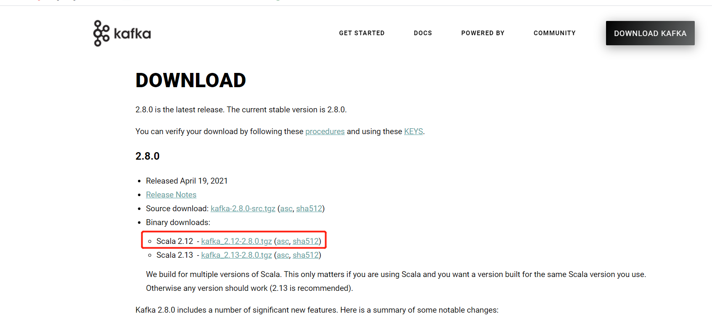
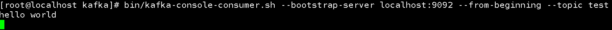

# 1. 安装与部署
- 单机模式部署：
    - 官网下载tgz包：http://kafka.apache.org/downloads.html，其中2.12是scala版本，2.8.0是kafka版本。最新版的kafka无需单独安装zookeeper。当我们使用Scala的时候，下载kafka需要注意Scala的版本，否则，任何版本都可以使用。如果没有用到Scala，那么就不会涉及到Scala，下载任一版本都行。
    
    - 解压tgz：`mkdir /opt/module`， `tar -zxvf kafka_2.12-2.8.0.tgz -C /opt/module/`
    - 重命名：`cd /opt/module/`，`mv kafka_2.12-2.8.0 kafka`
    - 在kafka下创建日志存放的文件夹：`cd kafka`，`mkdir logs`
    - 修改kafka配置文件：`vim config/server.properties`(该文件也可以配置kafka密码，此处省略):
        - broker.id：当前块的id号，该id号唯一，默认是0，也可以是其他值。如果是分布式部署，每台机器的kafka的broker.id都不一样
        - listeners：用来定义Kafka Broker的Listener的配置项。可以不进行配置
        - advertised.listeners：将Broker的Listener信息发布到Zookeeper中。可以不进行配置。
        - num.partitions：topic下分区的数量
        - log.dirs：消息的存放目录，因为kafka把消息使用日志的形式存储，所以这里不要和kafka的运行日志相混淆。
        - log.retentio.hours：消息保存的小时数
        - default.replication.factor：消息的副本数量，这是kafka高可用、数据不丢失的关键
        - zookeeper.connect：zookeeper的地址
    - 启动zookeeper：`bin/zookeeper-server-start.sh -daemon config/zookeeper.properties`
    - 启动kafka：`bin/kafka-server-start.sh -daemon config/server.properties`
    - 创建topic：`bin/kafka-topics.sh --create --zookeeper localhost:2181 --replication-factor 1 --partitions 1 --topic test`。
    
    - 查看topic列表：`bin/kafka-topics.sh  --list --zookeeper localhost:2181`
    - 生产消息：`bin/kafka-console-producer.sh --broker-list localhost:9092 --topic test`  
    
    - 消费者消费消息：`bin/kafka-console-consumer.sh --bootstrap-server localhost:9092 --from-beginning --topic test`  
    